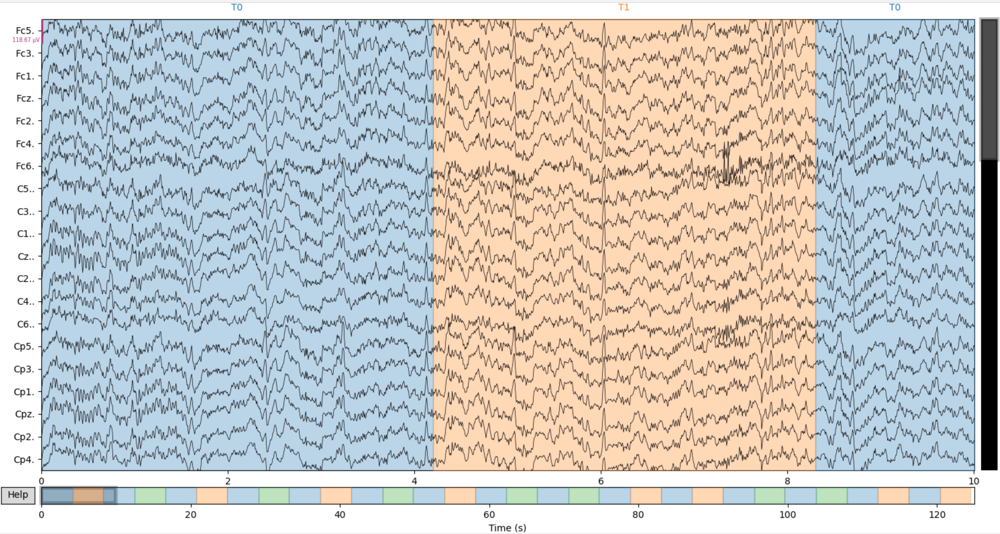
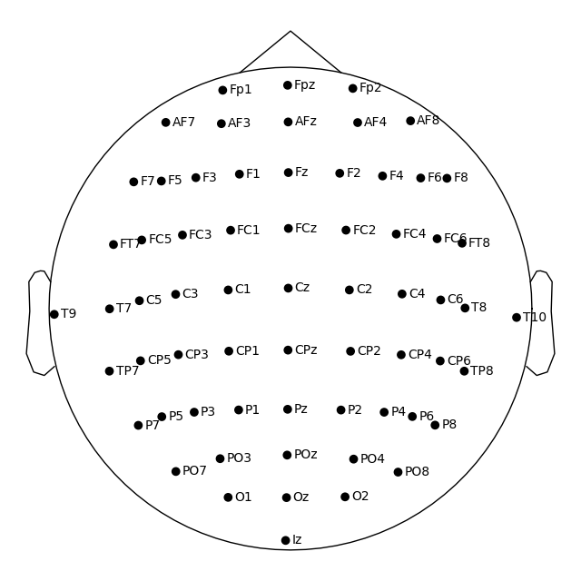
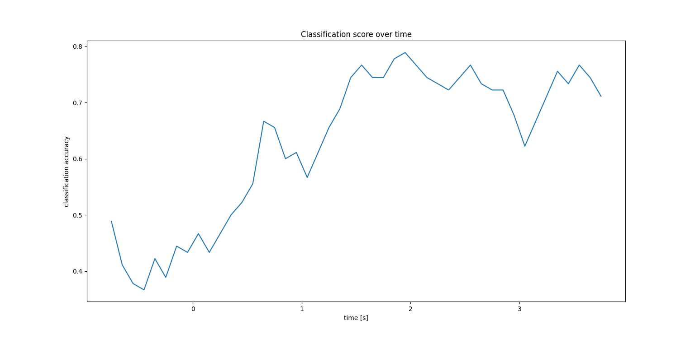
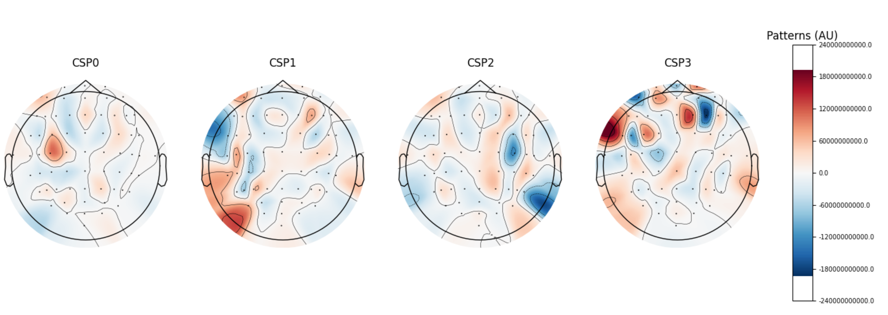

# total_perspective_vortex
This project aims to create a brain computer interface based on electroencephalographic data (EEG data) with the help of machine learning algorithms. Using a subject’s EEG reading, we will have to infer what he or she is thinking about or doing - (motion) A or B in a t0 to tn timeframe.



## Related article I wrote
- [Theory and Implementation of CSP(Common Spatial Pattern) Algorithm](https://medium.com/@hirok4/theory-and-implementation-of-csp-common-spatial-pattern-algorithm-f84300e3b4d6)

<br></br>

## Goals
- Process(parsing and filtering) EEG data
- Implement a dimensionality reduction algorithm
- Train and predict EEG data

<br></br>

## Dataset
Subjects performed different motor/imagery tasks while 64-channel EEG were recorded using the [BCI2000 system](http://www.bci2000.org). Each subject performed 14 experimental runs: two one-minute baseline runs (one with eyes open, one with eyes closed), and three two-minute runs of each of the four following tasks:

```
1. A target appears on either the left or the right side of the screen. The subject opens and closes the corresponding fist until the target disappears. Then the subject relaxes.

2. A target appears on either the left or the right side of the screen. The subject imagines opening and closing the corresponding fist until the target disappears. Then the subject relaxes.

3. A target appears on either the top or the bottom of the screen. The subject opens and closes either both fists (if the target is on top) or both feet (if the target is on the bottom) until the target disappears. Then the subject relaxes.

4. A target appears on either the top or the bottom of the screen. The subject imagines opening and closing either both fists (if the target is on top) or both feet (if the target is on the bottom) until the target disappears. Then the subject relaxes.
```

You can know details and get the EEG dataset from [here](https://physionet.org/content/eegmmidb/1.0.0/).



<br></br>

## CSP(Common Spatial Pattern) algorithm
Common Spatial Pattern is a technique to analyze multi-channel data based on recordings from two classes (conditions). CSP yields a data-driven supervised decomposition of the signal parameterized by a matrix $W(C\times C)$ ($C$ is the number of channels) that projects the signal $x(t)$ in the original sensor space to $x_{CSP}(t)$, which lives in the surrogate sensor space, as follows:

$$
x_{CSP}(t)=W^\intercal x(t) \tag{1}
$$

CSP, like PCA, allows for dimensionality reduction and is especially often used to analyze [EEG](https://en.wikipedia.org/wiki/Electroencephalography) data. The need for spatial filtering in EEG data analysis can be found [here](https://doc.ml.tu-berlin.de/bbci/publications/BlaTomLemKawMue08.pdf).


### How to calculate W
Here is the calculation method based on [this paper](https://www.jmlr.org/papers/volume4/parra03a/parra03a.pdf).  
The problem of recovering sources from their linear mixtures without knowledge of the mixing channel has been widely studied. In its simplest form it can be expressed as the problem of identifying the factorization of the $N$-dimensional observations $X$ into a mixing channel $A$ and $M$-dimensional sources $S$,

$$
X=AS \tag{2}
$$

We consider each column of $X$ and $S$ as a sample in time. In this case we can write Eq(1) as,

$$
x(t)=As(t) \tag{3}
$$

We begin by noting that the matrix $A$ explains various cross-statistics of the observations $x(t)$ as an expansion of the corresponding diagonal cross-statistics of the sources $s(t)$.
From Eq(3), we can find the follow equation

$$
\begin{align*}
x(t)x(t)^\intercal&=As(t)(As(t))^\intercal \\
&=As(t)s(t)^\intercal A^\intercal \\
&=AR_s A^\intercal
\end{align*} \tag{4}
$$

An obvious example is the time averaged covariance matrix, $R_x=\sum_t E[x(t)x^\intercal(t)]$, where **Rs
is diagonal if we assume independent or decorrelated sources.**

$$
R_x = AR_sA^\intercal \tag{5}
$$

The same process is performed for the other class of data, and using $Q$, the following equation is obtained

$$
Q_x = AQ_sA^\intercal \tag{6}
$$

Note that these two conditions alone are already sufficient for source separation. To recover the sources from the observation $x(t)$ we must find an inverse matrix $W$ such that $W^\intercal A=I$. In this case we have,

$$
s(t)=W^\intercal As(t)=W^\intercal x(t) \tag{7}
$$

Let us further assume nonzero diagonal values for $Q_s$. After multiplying Equations (3) and (4) with $W$ and Eq(4) with $Q_s^{-1}$ we combine them to obtain,

$$
R_xW = Q_xW\sigma \tag{8}
$$

where by assumption, $\sigma=R_sQ_s^{−1}$, is a diagonal matrix.

Eq(8) is obtained by the following calculation procedure.

$$
\begin{align*}
Q_xWQ_s^{-1} &=AQ_sA^\intercal WQ_s^{-1} \\
&=AQ_sQ_s^{-1} \\
&=A \\
R_xW&=AR_sA^\intercal W \\
&=AR_s \\
&=Q_xWQ_s^{-1}R_s \\
&=Q_xW\sigma
\end{align*} \tag{9}
$$

This constitutes a generalized eigenvalue equation, where the eigenvalues represent the ratio of the individual source statistics measured by the diagonals of $R_s$ and $Q_s$.
So we can obtain W by solving the generalized eigenvalue problem with Eq(8).

Implementaion of CSP algorithm with python is [here](https://github.com/Hiroaki-K4/total_perspective_vortex/blob/main/srcs/csp.py).

<br></br>

## Training and prediction
You can train and predict EEG data(Task 4) by running below command. `--subject_num` is the number of subjects used training and prediction. `--show` is the flag whether program shows the result.

```bash
python3 srcs/train_and_predict.py --subjects_num 1 --show
```



<br></br>

I used CSP algorithm for dimensional reduction. The lower image shows 4 spatial filters with large eigenvalues.



<br></br>

## References
- [EEG Motor Movement/Imagery Dataset](https://physionet.org/content/eegmmidb/1.0.0/)
- [Motor imagery decoding from EEG data using the Common Spatial Pattern (CSP)](https://mne.tools/stable/auto_examples/decoding/decoding_csp_eeg.html)
- [Optimizing Spatial Filters for Robust EEG Single-Trial Analysis](https://doc.ml.tu-berlin.de/bbci/publications/BlaTomLemKawMue08.pdf)
- [Blind Source Separation via Generalized Eigenvalue Decomposition](https://www.jmlr.org/papers/volume4/parra03a/parra03a.pdf)
